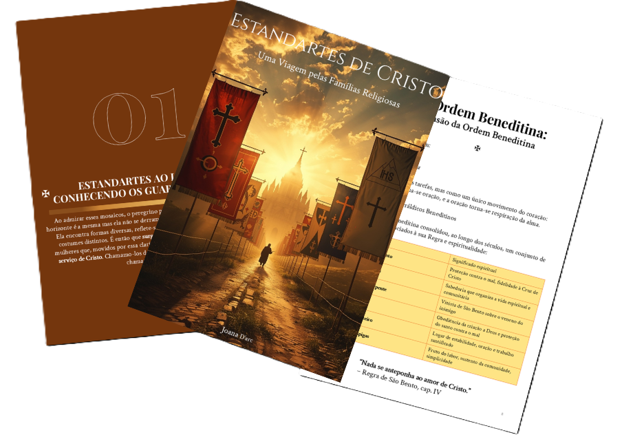

    

-------

# Projeto EBOOK Gerado por I.A.s

 > ℹ️ **NOTE:** Este é o repositório desenvolvido durante o curso no qual fui instrutor técnico na plataforma da [DIO](https://dio.me)

Projeto com o objetivo de gerar um ebook digital com as facilidades das ferramentas de IA. todos os prompts
seguem abaixo.

<a href="https://github.com/Andre-C-Monteiro/prompts-recipe-to-create-a-ebook/blob/main/output/ebook%20-%20Estandartes.pdf" title="View PDF now"> 📕Clique aqui para ler</a>

## 💻 Tecnologias utilizadas no projeto

- [ChatGPT](https://chat.openai.com/) 
- [Leonardo.AI](https://app.leonardo.ai/)
- [PowerPoint](https://www.microsoft.com/en/microsoft-365/powerpoint)

## 🧠 Prompts

ChatGPT：

|   Ação   | prompt                                                                                                                                                                                                                                                                         |
| :------: | ------------------------------------------------------------------------------------------------------------------------------------------------------------------------------------------------------------------------------------------------------------------------------ |
|  título  | Preciso que você sugira 10 títulos criativos para um eBook católico que abordará as principais congregações religiosas, como os agostinianos, dominicanos, jesuítas, entre outras. O conteúdo será apresentado de forma sucinta e acessível, pensado especialmente para pessoas que estão começando a ter contato com a fé. O eBook seguirá a estrutura narrativa da Jornada do Herói, de modo que os títulos devem refletir tanto a espiritualidade quanto o caráter inspirador dessa caminhada. Busque criar títulos curtos e cativantes.                                                        |
| conteúdo | 

Midjourney：

|  Ação  | prompt                                                                                 |
| :----: | -------------------------------------------------------------------------------------- |
| título | Epic Catholic illustration of several ancient religious banners (estandartes) waving under golden sunlight along a sacred medieval road. Each banner represents a different Catholic religious order, with distinct symbolic elements such as a black and white cross, a tau cross with cords, the IHS Christogram, a mountain with stars, and an open monastic rule with a cross. A pilgrim walks the path toward a radiant cathedral on the horizon, symbolizing a spiritual journey. Mystical, inspiring atmosphere, clouds opening to reveal heavenly light. Highly detailed, oil painting style, dramatic lighting, textured, solemn and uplifting, a blend of classical sacred art and fantasy realism. No text.

 |

## ✨ Features

- Conteúdo gerado via ChatGPT
- Imagens geradas via Leonardo.AI

## 📚 Materiais

- Imagens utilizadas em `assets`
- ebook gerado durante as aulas em `output`

## 🛠️ Instruções de execução

Utilize os prompts acima nas ferramentas sugeridas para gerar o material base e utilize uma ferramenta de edição de documentos como power point, libreoffice , indesign para diagramação.

## 👨‍💻 Expert

    
    
&nbsp&nbsp&nbspFelipe Aguiar 
    &nbsp&nbsp&nbsp
    <a href="https://github.com/felipeAguiarCode">
    GitHub</a>&nbsp;|&nbsp;
    <a href="www.linkedin.com/in/
felipe-exe">LinkedIn</a>
&nbsp;|&nbsp;
    <a href="https://www.instagram.com/felipeaguiar.exe/">
    Instagram</a>
&nbsp;|&nbsp;

  

---

⌨️ com 💜 por [Felipe Aguiar](https://github.com/felipeAguiarCode)